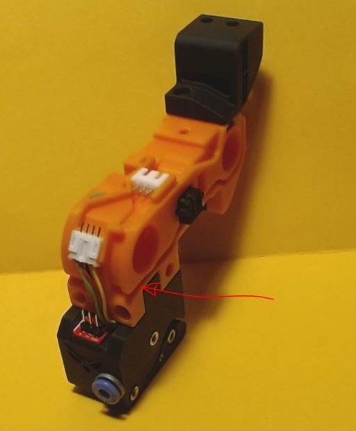
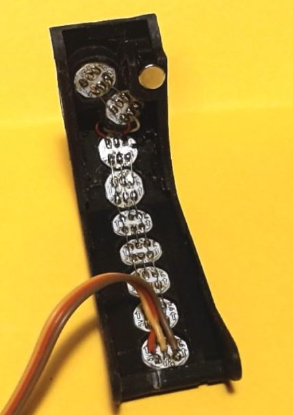

<h1 align="center">ERCF-Selector-LED-cover</h1> 
<H2 align="center">Under construction : use it with caution. </H2>

 

**To be able to add LEDs in the selector cover, you need to print the new selector and encoder.**
* The new selector have a second cable channel on the right side to allow the LED wires to come to the front. The servo holder had its own screew now. A 4 pins PH connector power the status LED and the give the DATA to the 3 pins XH connector that feed the cover LED. 
* Why a new encoder ? Because at a certain point in time, I had a lot of problem with the encoder. I had remove it to clean it. To solve that problem I decide to move the screws to the front, and made some other improvments :
  * New adjustable berake
  * Removeble brearing cover
  * The bearing can be adjusted to be in line with the BMG
  * ECAS is hold in place tighter
  * Opening around the bearing so it can be cleaned easily.
  * The bottom secret screw is back
  * Status LED insert in the eyes. The Binky LED shows in the mouth
* The cover LED has 7 LEDs to display the filament movement, 1 LED for the leafs, and 1 LED for the carrot. 

 

 

The encoder and selector are tested. 
The new cover, is not yet tested.
 

## Summary.
* **[Bom](#bom)**
* **[Printing Tips](#printing-tips)**
* **[Assembling tips](#assembling-tips)**
 
# more to come shortly...

# BOM

# Printing tips
* The cover must be printed in 2 colors. The windows should be printed in transparent color. Load the cover in the slicer and split it into parts, then assign the colors to each bodies.

# Assembling tips